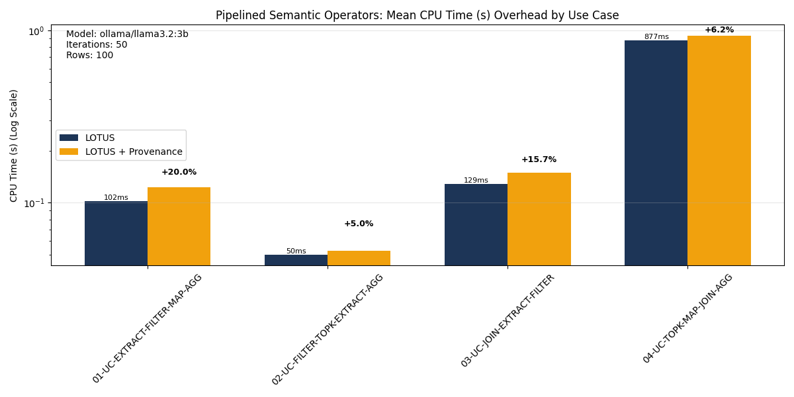
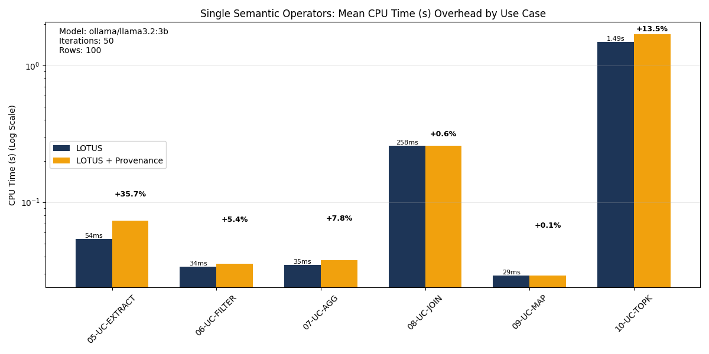
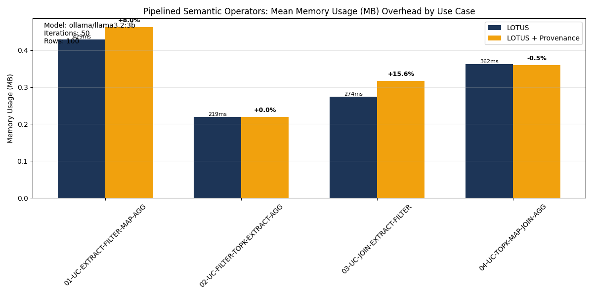
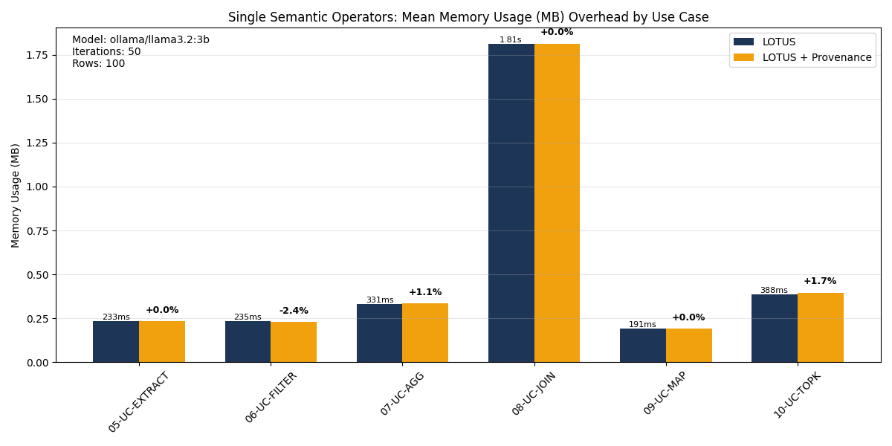

# Experiments and Benchmarks

# LOTUS Benchmarking: Custom Source Code Setup

Since we have modified the **LOTUS** source code, you need to ensure your environment uses your local version rather than the official package. This guide covers how to set up your modified version and describes the default experiment parameters.

---

## Using Our Modified LOTUS Source
To use the library with our custom changes, install Lotus in **Editable Mode**. This allows code edits in your local directory.

1. **Navigate to the LOTUS root directory**:

    First clone the project then, navigate to the LOTUS root directory on branch provenance_tracking_for_semantic_operations:
   ```bash
   cd /path/to/your/modified/lotus
    ```
2. **Install in Editable Mode**:

    **Note: If you are using a virtual environment, ensure it is activated before running this command.**

    ```bash
    pip install -e .
    ```

3. **Verify Installation**:
    ```bash
    pip show lotus-ai
    ```
## Database Initialization
Before running benchmarks, you need to install extra requirements and index the IMDB data into your local SQLite database.

**Note: make sure DB_PATH is correct in sqlite_db.py**

Run the provided indexing script:
   ```bash
pip install -r examples/provenance_examples/requirements.txt
python examples/provenance_examples/examples/data/sqlite_db.py  
```
## Benchmark steps:
Run this script for benchmark:

***Note***
Please set the correct path to the result file, set `RESULT_FILE` in `benchmarking_provenance.py`

***Note***
Please set correct LLM for `BENCHMARKING_MODEL` in `benchmarking_provenance.py` and make sure API-key is set correctly. (check main lotus readme.md for setting API-key)

```bash
python examples/provenance_examples/benchmark/benchmarking_provenance.py
```

Recording Phase: The script first runs the query to fetch real LLM responses and stores them in the cache/ directory.

Replay Phase: It then uses a MockLM to replay these cached responses, ensuring that "Vanilla" and "Provenance" runs use the exact same LLM outputs.

Metrics: The script measures Wall Time, CPU Time, and Peak Memory usage using tracemalloc.

Comparison: Each use case is run in two modes:

Vanilla: LOTUS execution with provenance tracking disabled.

Provenance: LOTUS execution with provenance tracking enabled.

Output: Results are appended to a .jsonl file and printed to the console in a summary table. 


## plots
To generate plots from the experiment results, run:

**Note: make sure raw_data_path is correct in plot_benchmark.py/main**
   ```bash
python examples/provenance_examples/benchmark/plot_benchmark.py
```

## Experimet Result and Setup
* **Dataset**: IMDB movie reviews indexed in SQLite.
* **LLM**: Local `ollama/llama3.2:3b`.
* **Hardware**: Apple M1 Pro, 32GB RAM].

## Execution Scripts
* **Benchmark Script**: `benchmark.py` (referenced as "Benchmark" in git log).
* **Mock LLM Script**: `mock_llm.py` — Used to isolate provenance overhead from LLM inference time.

## Results & Logs
Detailed performance metrics for the 10 pipelines are available in the repository under: `results/raw_data/`
Plots can be found in `results/plots/`.
* **CPU/Memory Logs**: Results showing that provenance tracking is significantly less resource-intensive than LLM inference.
* **Key Findings**: 
    * Provenance tracking overhead is relatively small in memory but also in CPU time compared to LLM inference.
      * with approx. +10.9% on average for CPU time (ranging from +0.1% to max. +33.7% )
      * +3.4% on average for memory usage (ranging from + 0.1% to max. +15.6%)
    * Using the source directly instead of wrappers keeps overhead low.
    * check the plot and benchmark log folder for results.
* **Contraints**: 
    * the dataset is limited to 100 records, in the `results/plots/` folder, more plots for 200 record size data can be found aswell
    * the original dataset contains 50k movie reviews (`/../examples/data/`). We limit the `review` text to a maximum of 200 characters as a cost tradeoff
    * we ensured a consistent environment for all exmperiments (single machine, mocked LM, etc.) but variations in measurements could not be fully eliminated


### CPU Time Overhead
CPU Clock Time (in seconds)

 

### Memory Overhead
Mean of the peak memory usage (in MB) measured over all iterations

 